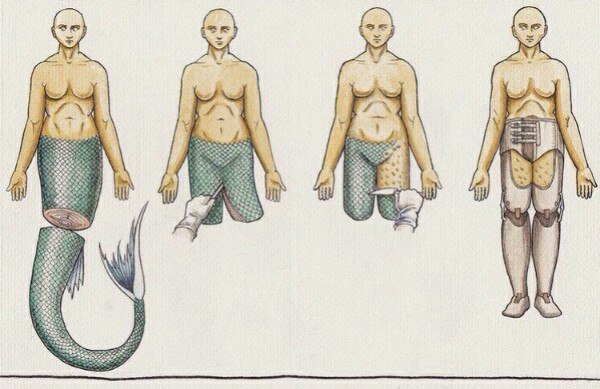

## Ubuntu Swiss Army Knife

Tools, installs & tweaks for everyday happy life.

Next generation Ubuntu 16.04/18.10 install scripts & tools.

### Dev
  :hocho: Git 
  :hocho: Node.js 
  :hocho: React.js & Node.js tools 
  :hocho: VSCode & VSCode Insiders 
 
### Shell
  :hocho: Guake 
  :hocho: [ZSH Quickstart Kit](https://github.com/unixorn/zsh-quickstart-kit) (Oh-my-zsh, zgen) 
  :hocho: [Spaceship Prompt](https://github.com/denysdovhan/spaceship-prompt) 

### Appearance
  :hocho: [Plank Dock](https://github.com/B00merang-Project/macOS-High-Sierra-Dark) 
  :hocho: [Frost Plank Theme](https://github.com/dikiaap/frost-plank-theme) 
  :hocho: [Ken Harkey Plank Themes](https://github.com/KenHarkey/plank-themes) 
  :hocho: [MacOS High Sierra Dark](https://github.com/B00merang-Project/macOS-High-Sierra-Dark) 
  :hocho: [MacOS High Sierra Dark](https://github.com/B00merang-Project/macOS-High-Sierra-Dark) 
  :hocho: [Ant](https://github.com/EliverLara/Ant) 
  :hocho: [Ant Nebula](https://github.com/EliverLara/Ant-Nebula) 
  :hocho: [Papirus Icons](https://github.com/PapirusDevelopmentTeam/papirus-icon-theme) 
  :hocho: [Fira Code Font](https://github.com/tonsky/FiraCode) 

### TODO:
  - [x] Common install script
  - [ ] Install options select
